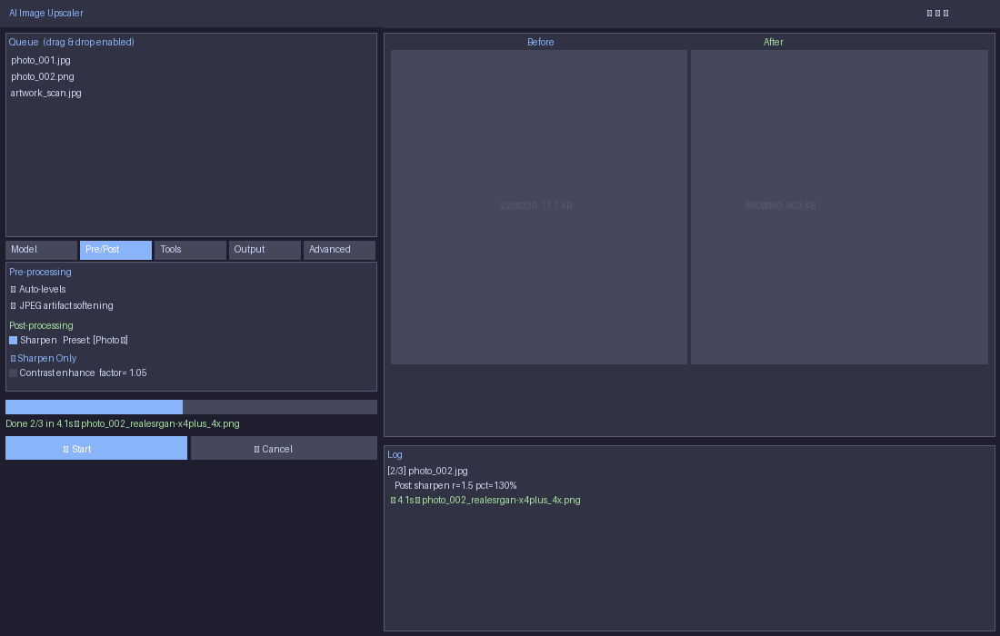

# AI Image Upscaler

A Windows desktop app that upscales images using [Real-ESRGAN ncnn-Vulkan](https://github.com/xinntao/Real-ESRGAN-ncnn-vulkan) with a polished Tkinter GUI.  
Works entirely **offline** — no cloud, no subscriptions, no GPU driver lock-in (AMD, NVIDIA, Intel all supported via Vulkan).



---

## Features

| Category | What it does |
|---|---|
| **Upscaling** | 2×, 3×, 4× via any NCNN `.param/.bin` model — built-in and custom |
| **2-Pass enhance** | Chain two models (e.g. x4plus → UltraSharp) for maximum detail |
| **Pre-processing** | Auto-levels, JPEG artifact softening, NLM denoising (strength slider) |
| **Post-processing** | Unsharp mask sharpening (on by default), contrast enhancement |
| **Background removal** | One-click via [rembg](https://github.com/danielgatis/rembg) / U2Net — saves a separate `_nobg.png` |
| **Smart crop** | Auto-detects persons, animals, objects via YOLOv8n, crops & pads to subject before upscaling |
| **Output formats** | PNG, JPEG (quality slider), WebP (quality slider) |
| **Filename templates** | `{stem}_{model}_{scale}x` — fully configurable |
| **EXIF preservation** | Copies EXIF metadata from source to JPEG output |
| **Batch queue** | Drag-and-drop, add folders (recursive), reorder, multi-select remove |
| **Before/After preview** | Side-by-side canvases that resize with the window, with resolution info |
| **Live log** | Colour-coded subprocess output per image |
| **Model reference** | Scrollable panel describing every included model and what it's for |
| **Settings persistence** | All settings saved to `settings.json` on close |
| **Dark / Light theme** | Toggle in the Advanced tab |
| **Cancel** | Immediately kills the running subprocess |

---

## Requirements

- **Windows 10/11** (64-bit)
- **Python 3.10+**
- A GPU with Vulkan support (AMD, NVIDIA, or Intel — very old cards may fall back to CPU)

---

## Quick Start

```powershell
# 1. Clone
git clone https://github.com/Zushikina-kun/AIU-Image-AI-Upscaler.git
cd "AIU-Image-AI-Upscaler"

# 2. Install Python dependencies
python -m pip install -r requirements.txt

# 3. Run
python main.py
```

> **Note:** `rembg` downloads the U2Net model (~170 MB) on first background-removal use.  
> `ultralytics` downloads the YOLOv8n model (~6 MB) on first smart-crop use.

---

## NCNN Models Included

The `models/` folder ships with pre-converted `.param/.bin` pairs ready for inference.  
`.pth` / `.safetensors` weight files are **not** included (too large for Git) — see [Model Guide](#model-guide) below.

| Model | Scale | Best for |
|---|---|---|
| `realesrgan-x4plus` | 4× | General photos — the safe default |
| `realesrgan-x4plus-anime` | 4× | Anime / flat-colour art |
| `realesrnet-x4plus` | 4× | Lighter / faster general upscaling |
| `realesr-animevideov3-x2/x3/x4` | 2/3/4× | Video frames — low temporal flicker |
| `4x-UltraSharp-fp16` | 4× | AI-generated art, crisp edges (fp16 weights) |
| `4x-UltraSharp-fp32` | 4× | Same as above but FP32 — better on older AMD GPUs |

---

## Model Guide

### Choosing the right model

| Your image | Recommended model |
|---|---|
| Real-world photo (JPEG/PNG) | `realesrgan-x4plus` |
| Anime illustration / manga | `realesrgan-x4plus-anime` or `4x-AnimeSharp` |
| AI-generated art | `4x-UltraSharp-fp32` or `4x-UltraSharpV2` |
| Screenshot / digital art | `4x-UltraSharp-fp32` |
| Video frames | `realesr-animevideov3-x4` |
| Quick / low-VRAM | `realesr-general-x4v3` |
| Just clean up noise, no resize | `1x-UnResizeOnly_RCAN` |

### Model descriptions

| Model | Description |
|---|---|
| **realesrgan-x4plus** | 23 RRDB blocks, ~64 MB. General-purpose 4× upscaler for real-world photos. Best all-rounder — handles JPEG compression, blur, and noise. Use this when unsure. |
| **realesrgan-x4plus-anime** | 6 RRDB blocks, ~18 MB. Optimised for anime / line art / flat-colour illustrations. Avoids over-sharpening smooth gradients. |
| **realesrnet-x4plus** | Lighter x4plus variant. Good when you want sharpening without hallucinating texture detail. |
| **realesr-animevideov3-x2/x3/x4** | Video-optimised anime models. Tuned for temporal consistency across frames — minimal flickering. |
| **realesr-general-x4v3** | Tiny (~5 MB), fast. Great for low-VRAM GPUs or speed-over-quality scenarios. |
| **realesr-general-wdn-x4v3** | Same tiny model with a built-in wavelet denoising component. Use on noisy/grainy inputs. |
| **4x-UltraSharp** | Community favourite for AI-generated art and digital illustrations. Crisp, high-contrast edges. Can over-sharpen natural photos. |
| **4x-UltraSharp-fp16** | FP16 variant. Smaller GPU memory footprint, virtually identical quality. Preferred on modern NVIDIA cards. |
| **4x-UltraSharp-fp32** | FP32 variant. More numerically stable on older AMD GPUs (RX 580, etc.) where fp16 accumulation can cause soft output. |
| **4x-UltraSharpV2** | Updated V2 — better texture fidelity, less ringing. Current recommended version for AI art (2024+). |
| **4x-AnimeSharp** | Alternative anime 4× model. Sharper edges than x4plus-anime. |
| **4x_NMKD-UltraYandere** | Community anime model. Strong detail enhancement for stylised art and manga. |
| **4x_NMKD-YandereNeoXL** | Newer NMKD anime model with improved edge handling. |
| **4x_BooruGan_650k** | Trained on Danbooru-style anime. Excellent for fan art and detailed hair. |
| **1x-UnResizeOnly_RCAN** | No upscaling. Uses RCAN to restore/denoise without changing resolution — clean up JPEG artefacts before a separate upscale pass. |

### Adding new models

1. Download a `.param` + `.bin` pair (e.g. from [OpenModelDB](https://openmodeldb.info) or [Civitai](https://civitai.com))
2. Drop both files into the `models/` folder
3. Click **Tools → Refresh Model List** in the app

To convert a `.pth` PyTorch checkpoint to NCNN format, see [model converter.py](#model-converter).

---

## Pre & Post Processing

### Pre-processing (applied before upscaling)

| Option | What it does | When to use |
|---|---|---|
| **Auto-levels** | Normalises contrast via `ImageOps.autocontrast` | Washed-out or over-exposed inputs |
| **JPEG artifact softening** | Median filter to reduce block artefacts | Heavily compressed JPEGs |
| **NLM Denoise** (h slider) | OpenCV `fastNlMeansDenoisingColored` — h=1 light, h=10 medium, h=20+ heavy | Grainy/noisy photos or scans |

### Post-processing (applied after upscaling)

| Option | What it does | Default |
|---|---|---|
| **Sharpen** | Pillow `UnsharpMask` — radius, percent, threshold sliders | **On** (r=1.5, 120%, t=3) |
| **Contrast enhance** | `ImageEnhance.Contrast` — 1.0 = no change | Off |

> **Why is sharpening on by default?**  
> ESRGAN models are trained to avoid over-sharpening artifacts, which makes their output look slightly soft compared to the input when viewed at 1:1. A mild unsharp mask post-pass restores the perceived crispness without ringing.

---

## Tools

### Background Removal

Uses [rembg](https://github.com/danielgatis/rembg) with the U2Net model.

- Enable the checkbox in the **Tools** tab
- After upscaling, a `_nobg.png` file with transparent background is saved alongside the main output
- First use downloads the U2Net model (~170 MB, cached in `~/.u2net/`)

### Smart Crop / Subject Focus

Uses [Ultralytics YOLOv8n](https://docs.ultralytics.com/) (6 MB nano model).

- Enable in the **Tools** tab
- The largest detected subject (person, animal, or custom class) is cropped with 10% padding before upscaling — you get a tight, high-res version of just the subject
- **Pad to square** option ensures the crop has equal width/height (recommended for most upscaling models)
- **Detect classes** field accepts comma-separated labels, e.g. `person,animal,car`

---

## Output Settings

### Filename Template

Default: `{stem}_{model}_{scale}x`

| Variable | Replaced with |
|---|---|
| `{stem}` | Original filename without extension |
| `{model}` | Model name |
| `{scale}` | Scale factor (2, 3, or 4) |
| `{ext}` | Output extension |

Example: `photo_realesrgan-x4plus_4x.png`

### Format

| Format | Notes |
|---|---|
| **PNG** | Lossless. Recommended for maximum quality. |
| **JPEG** | Lossy. Use quality 85–95. Smaller file. EXIF preserved if piexif is installed. |
| **WebP** | Lossy/lossless. Good balance of quality and size. |

---

## Advanced Settings

| Setting | Default | Notes |
|---|---|---|
| **GPU ID** | `0` | Use `auto` to let Vulkan pick. Set to `0,1` for multi-GPU. |
| **Tile size** | `0` | `0` = auto. Lower (e.g. `128`) if you get VRAM out-of-memory errors. |
| **Threads** | `2:2:2` | `load:proc:save`. Increase for batches of small images. |
| **TTA mode** | Off | Test-Time Augmentation — 8× slower, marginally sharper edges. |

---

## Model Converter

`model converter.py` converts `.pth` / `.safetensors` weights to NCNN `.param/.bin` format.

### Pipeline

```
.pth / .safetensors  →  ONNX  →  NCNN .param + .bin
     (PyTorch)           ↑            ↑
                  torch.onnx.export  onnx2ncnn
```

### Prerequisites

```powershell
# Install converter dependencies
pip install torch torchvision  # see requirements.txt for CUDA/CPU variants
pip install realesrgan safetensors onnx onnxruntime

# Install onnx2ncnn (ships with ncnn release)
# Download from: https://github.com/Tencent/ncnn/releases
# Add to PATH or set ONNX2NCNN_EXE environment variable
```

### Usage

```powershell
# Convert all .pth/.safetensors in models/
python "model converter.py"

# Convert a specific model
python "model converter.py" --model 4x-UltraSharpV2.safetensors

# Convert with FP16 weights (smaller .bin file)
python "model converter.py" --fp16

# Dry run — see what would be converted without doing it
python "model converter.py" --dry-run

# Override scale factor
python "model converter.py" --scale 2
```

---

## Video Upscaling (Manual Workflow)

The app processes images. For video, extract frames first:

```powershell
# 1. Extract frames
mkdir tmp_frames
ffmpeg -i input_video.mp4 -qscale:v 1 -qmin 1 -qmax 1 -vsync 0 tmp_frames/frame%08d.jpg

# 2. Add tmp_frames/ folder to the queue and upscale
#    Recommended model: realesr-animevideov3-x2 or x4

# 3. Merge frames back with audio
ffmpeg -i out_frames/frame%08d.png -i input_video.mp4 -map 0:v:0 -map 1:a:0 `
       -c:a copy -c:v libx264 -r 23.98 -pix_fmt yuv420p output_upscaled.mp4
```

---

## Building a Standalone EXE

```powershell
pip install pyinstaller
pyinstaller main.spec
# Output: dist/AI Image Upscaler.exe
```

The `.spec` file bundles the tkinterdnd2 DLL and `icon.ico` automatically.

---

## Troubleshooting

| Symptom | Fix |
|---|---|
| Output looks soft / blurry | Enable **Post → Sharpen** (it's on by default). For heavy JPEG inputs, also enable Pre → JPEG artifact softening |
| AMD GPU output looks blurry / wrong | Use `4x-UltraSharp-fp32` instead of fp16 variants. The RX 580 / Polaris family has a known fp16 accumulation issue in Vulkan |
| "Executable not found" | Make sure `realesrgan-ncnn-vulkan.exe` is in the same folder as `main.py` |
| VRAM out of memory | Set Tile size to `128` or `64` in the Advanced tab |
| Background removal not working | Run `pip install "rembg[cpu]"` and restart the app |
| Smart crop not working | Run `pip install ultralytics` and restart the app |
| Model not appearing in list | Drop `.param` + `.bin` files into `models/` then click Tools → Refresh Model List |
| Very slow first run | rembg (~170 MB) and YOLOv8n (~6 MB) download on first use — subsequent runs are instant |

---

## Project Structure

```
AIU-Image-AI-Upscaler/
├── main.py                    # Main application
├── model converter.py         # PTH → ONNX → NCNN conversion utility
├── main.spec                  # PyInstaller build spec
├── requirements.txt           # Python dependencies
├── icon.ico                   # App icon
├── realesrgan-ncnn-vulkan.exe # Inference binary (Vulkan GPU)
├── vcomp140.dll               # Visual C++ runtime for the binary
├── vcomp140d.dll              # Visual C++ runtime (debug)
├── onepiece_demo.mp4          # Demo video for frame-extraction workflow
├── models/
│   ├── *.param                # NCNN model graph files
│   ├── *.bin                  # NCNN model weights
│   └── requirements_pth2ncnn.txt
└── BasicSR/                   # BasicSR submodule (for model conversion only)
```

---

## Credits

- [Real-ESRGAN](https://github.com/xinntao/Real-ESRGAN) — Xintao Wang et al., Tencent ARC Lab
- [Real-ESRGAN ncnn-Vulkan](https://github.com/xinntao/Real-ESRGAN-ncnn-vulkan) — Vulkan inference binary
- [4x-UltraSharp](https://huggingface.co/Kim2091/UltraSharp) — Kim2091
- [rembg](https://github.com/danielgatis/rembg) — Daniel Gatis
- [Ultralytics YOLOv8](https://github.com/ultralytics/ultralytics) — Ultralytics
- [BasicSR](https://github.com/xinntao/BasicSR) — Xintao Wang et al.
- [tkinterdnd2](https://github.com/pmgagne/tkinterdnd2) — pmgagne

---

## License

MIT — see [LICENSE](LICENSE)
